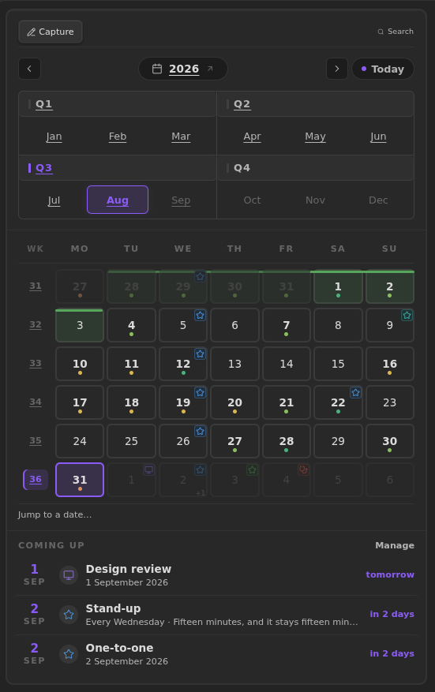
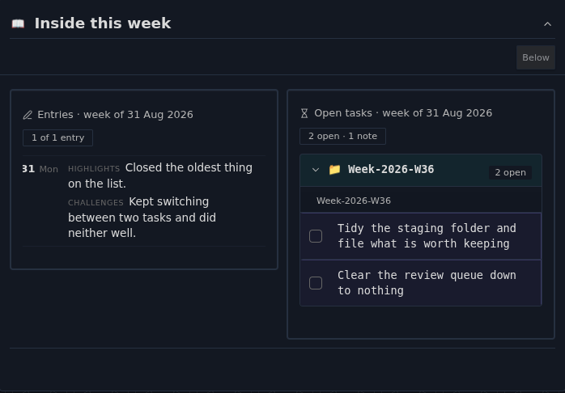
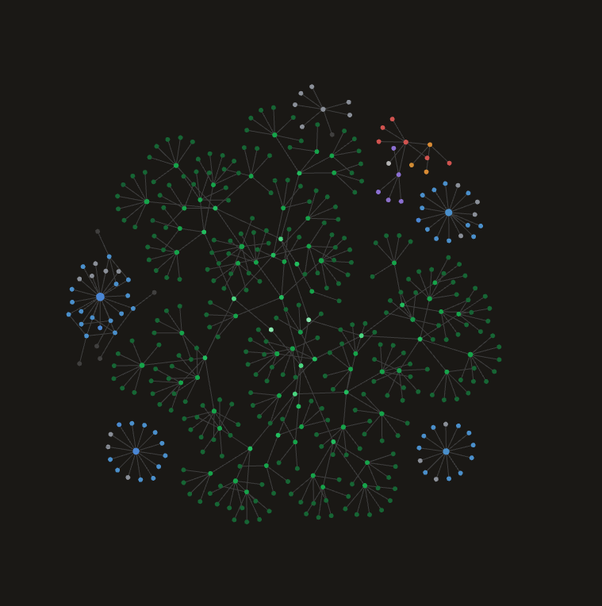

# ChronoAnvil

A self-contained journaling and study-journal system for
[Obsidian](https://obsidian.md) — diary entries, journals you define yourself,
one tracker registry across both, and native charts, calendars, tables and
dashboards drawn by the plugin itself.

It replaces Templater, Meta Bind, Tracker, Tasks and Dataview for this workflow.
[Bases](https://help.obsidian.md/bases) is still needed for the standalone
`.base` files.

## What it does

| | |
| --- | --- |
| **Diary** | Daily and monthly entries, a calendar with heat map and special events, week / month / quarter / year dashboards, full-text search filtered by date, tag and tracker, on-this-day and a timeline. |
| **Journals** | Define your own, with your own levels and note types. A Study journal — subjects → topics → lessons and practice — ships as an optional preset. |
| **Trackers** | Defined once, then synced into the templates and `Diary.base`. Steppers, scales, times, dates, dropdowns and habit chips; any tracker can also be added to a single entry on the day. |
| **Charts** | Line, bar, calendar heat map, scatter, streak and summary, drawn from your own frontmatter onto dashboards and journal indexes. |
| **Capture** | Quick capture into any entry that can hold one, plus review queues, recall decks, attachments and task rollups. |

## Visual tour

<!-- REPLACE the URL below once the tour recording is uploaded to YouTube. The
     source capture is a 38 MB GIF, far too heavy to inline in a README — the
     link is deliberate, not a placeholder for an embed. -->
▶ **[Watch the tour](https://youtu.be/REPLACE_WITH_VIDEO_ID)** — the same vault, moving.


Everything here is drawn by the plugin from your own frontmatter — no Dataview
query, no Templater script, no chart plugin.

| Native calendars and heat maps | One tracker registry, everywhere |
| :---: | :---: |
|  |  |
| *Heat maps, special events, four grains of calendar* | *Scales, times and steppers, on the entry itself* |

| Charts from your frontmatter | Custom journals and the Study preset |
| :---: | :---: |
|  |  |
| *Bar, line, summary and dual-axis time-of-day* | *Your own levels and note types, with reviews* |

| Period dashboards | The vault it builds |
| :---: | :---: |
|  |  |
| *Week, month, quarter and year, rolled up from the days* | *Entries chained by period, journals branching off* |

Nothing above is themed by the plugin. Every colour comes from your vault's own
theme, so the same homepage looks like this under three of them:


*One page, three themes, cut on the diagonal — left to right: neutral grey,
warm, cool. Text sits differently in each because the themes set their own
fonts; the panels, spacing and accents are the plugin reading your theme's
variables rather than painting over them.*

## Install

Download `main.js`, `manifest.json` and `styles.css` from a
[release](../../releases) into `<vault>/.obsidian/plugins/chronoanvil/`, enable
it under **Settings → Community plugins**, then run **ChronoAnvil: Maintenance:
set up / repair vault** to scaffold the folders and dashboards.

Those three files are the whole plugin — the notes it scaffolds are compiled
into `main.js`, so there is nothing else to copy.

## Keyboard

No shortcut is claimed. Every command lives in the palette under
**ChronoAnvil:**, and any of them can be bound in **Settings → Hotkeys**.

The one worth binding first is **Search everything** — full-text across the
diary and every journal, with date, tag and tracker filters.

## Upgrading from Almanac

ChronoAnvil was called **Almanac** through 4.84. The rename changed the plugin
id, so Obsidian treats it as a different plugin: nothing is lost, but nothing
moves by itself.

```bash
node tools/migrate-vault.mjs <vault>            # dry run — writes nothing
node tools/migrate-vault.mjs <vault> --write    # rewrite it, backup first
```

That rewrites the tokens inside your notes, renames `Almanac.canvas`,
`.almanac-registry.json` and each `.almanac-journal.json`, and moves the plugin
folder so `data.json` comes with it.

**It is not urgent.** The plugin reads both spellings everywhere not finding one
would cost you content, and writes only the new spelling — so an un-migrated
vault opens, works, and migrates itself as you touch it. If your settings look
empty on first launch they are not gone: they are restored from
`.almanac-registry.json` in the vault root.

## Build from source

```bash
npm install
npm test          # 5,100+ tests, ~5s
npm run package   # → dist/chronoanvil/, ready to copy into a vault
```

`npm run dev` watches. `./build.sh` is a thin wrapper that installs dependencies
first if they are missing.

## Documentation

- **[Reference](assets/documentation.md)** — every command, widget, directive
  and setting. The same file the plugin writes into your vault when it
  scaffolds, so it is readable here before you install anything.
- **[Changelog](CHANGELOG.md)** — reader-facing release notes.

## Contributing

Issues and pull requests are welcome. The test suite is the contract: `npm test`,
`npm run typecheck` and `npx eslint src test` must all be clean. Many tests
assert *why* something is written the way it is — read the comment before
changing one.

[CONTRIBUTING.md](./CONTRIBUTING.md) carries the licensing terms. The short
version: you keep your copyright, and your work is published under the AGPL-3.0
like everything else.

## Support

ChronoAnvil is free software and stays that way. If it has earned a place in
your vault, [Ko-fi](https://ko-fi.com/ahrymx) is where to say so — the same link
Obsidian shows beside the plugin, from `fundingUrl` in the manifest.

## License

Copyright © 2026 AhryMX <contact@ahrymx.dev> — licensed under the
**[GNU Affero General Public License v3.0 or later](./LICENSE)**, with
attribution and naming terms under its section 7.

You are free to use, study, modify, redistribute and sell this software. In
return you must preserve the copyright and licence notices, keep the attribution
*"ChronoAnvil, originally developed by AhryMX"*, mark a modified version as
different from the original, license your version under the AGPL-3.0, and make
the complete corresponding source available to everyone who receives it —
including users who reach it over a network.

Ordinary use is free and needs no permission, companies included: the copyleft
obligations apply when you distribute or offer a network service, not when you
use the plugin in your own vault. Fork freely — but pick your own name and say
where it came from, because section 7 bars using "ChronoAnvil" or "AhryMX" for
publicity or in a way that implies this project endorses your version.

[LICENSING.md](./LICENSING.md) is the plain-English guide with an FAQ.
Third-party components bundled into `main.js` — Chart.js and @kurkle/color, both
MIT — are attributed in [NOTICE](./NOTICE).
