# ChronoAnvil

A self-contained journaling, diary, habit tracking and study system for
[Obsidian](https://obsidian.md) — daily entries, custom journal hierarchies,
one unified tracker registry across both, and native charts, calendars, hourly
schedules and period dashboards drawn by the plugin itself.

It replaces Templater, Meta Bind, Tracker, Tasks and Dataview for this workflow.
[Bases](https://help.obsidian.md/bases) is still supported for standalone
`.base` files.

## What it does

| | |
| --- | --- |
| **Diary** | D/W/M/Q/Y entries, overviews (dashboards), calendars, heat maps, and special events, full-text search filtered by date, tag and tracker, on-this-day and timeline recaps. |
| **Journals** | Define your own custom journals with folder levels and note types. Presets for Study (*Subjects → Topics → Lessons/Practice*), Projects, Fitness, and Media ship ready to use. |
| **Trackers** | Defined once, synced everywhere. Numberless rating scales, dynamic bedtime & wake-up buttons with live sleep/wake duration, steppers, dropdowns, multi-row tag flow, and habit pills. Any tracker can be added to individual entries on the fly. |
| **Charts** | Line, bar, calendar heat map, scatter correlation, streak and summary stat cards, rendered natively from your frontmatter onto dashboards and journal indexes. |
| **Scheduling** | The week by the hour: an interactive hourly scheduling grid with color-coded event blocks, logbooks, and task blocks. |
| **Customizer** | Modular section & widget catalogue, rich page ground textures (scanlines, dot grid, graph paper, weaves), and adaptive theme styling. |

## Visual tour

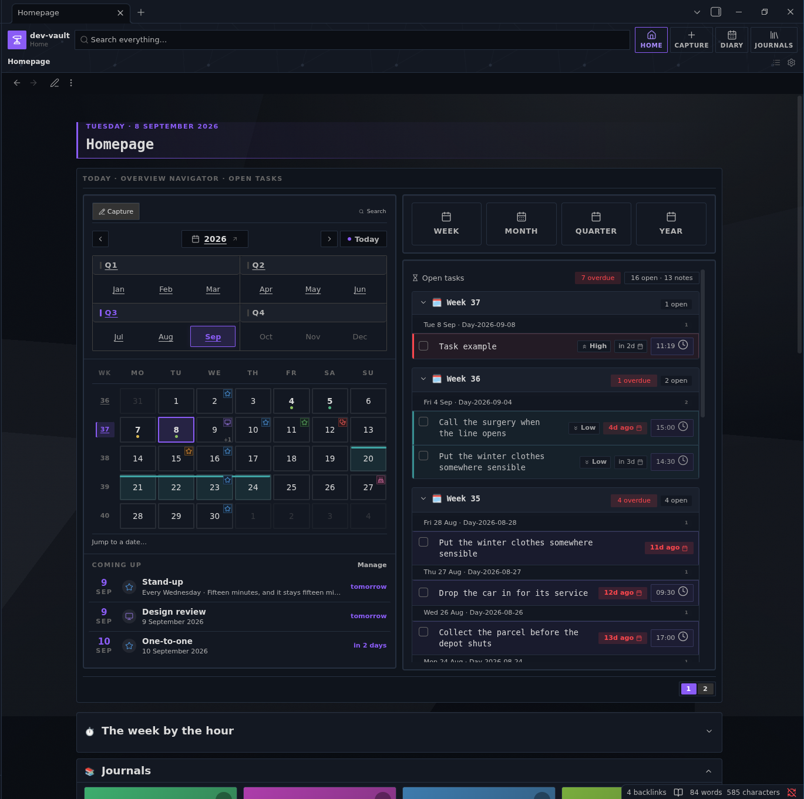

Everything here is drawn by the plugin from your own frontmatter — no Dataview
queries, no Templater scripts, no external chart plugins.

| Daily entry & dynamic trackers | Native charts & rolling statistics |
| :---: | :---: |
| 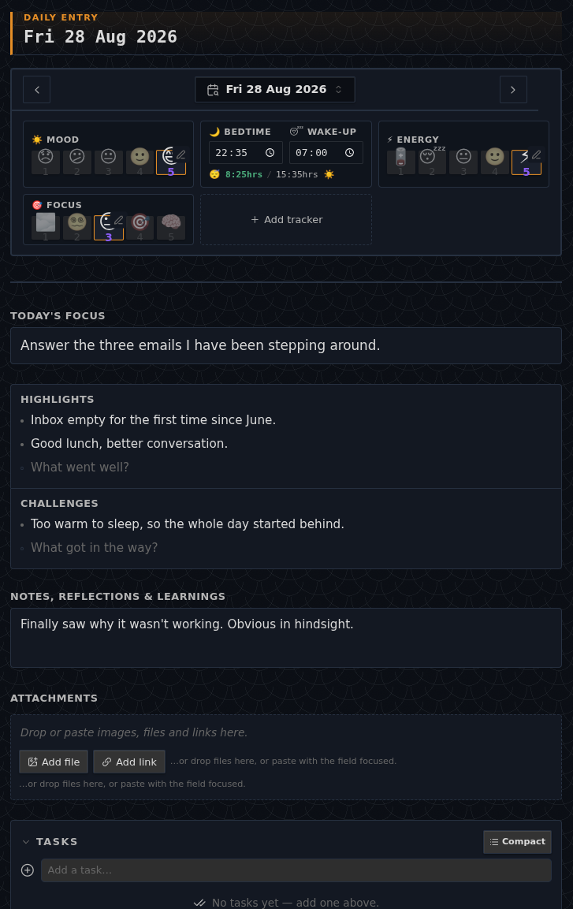 | 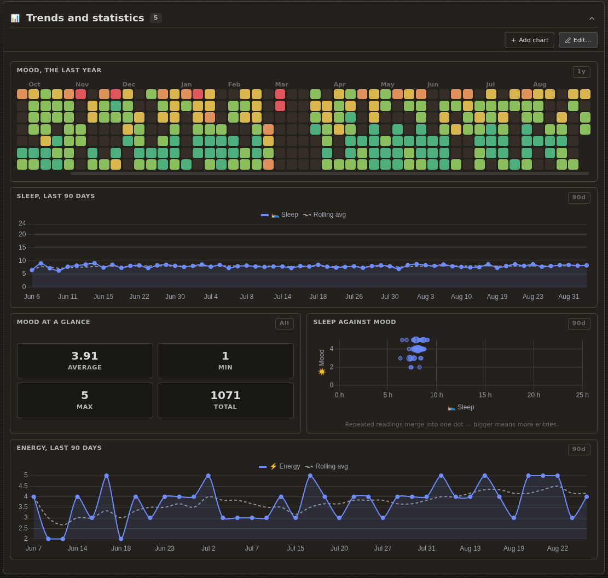 |
| *Dynamic sleep buttons, numberless scales, 2-row tags* | *Annual heatmaps, 90d rolling averages, scatter plots* |

| Custom journals &  presets | Period dashboards & digests |
| :---: | :---: |
| 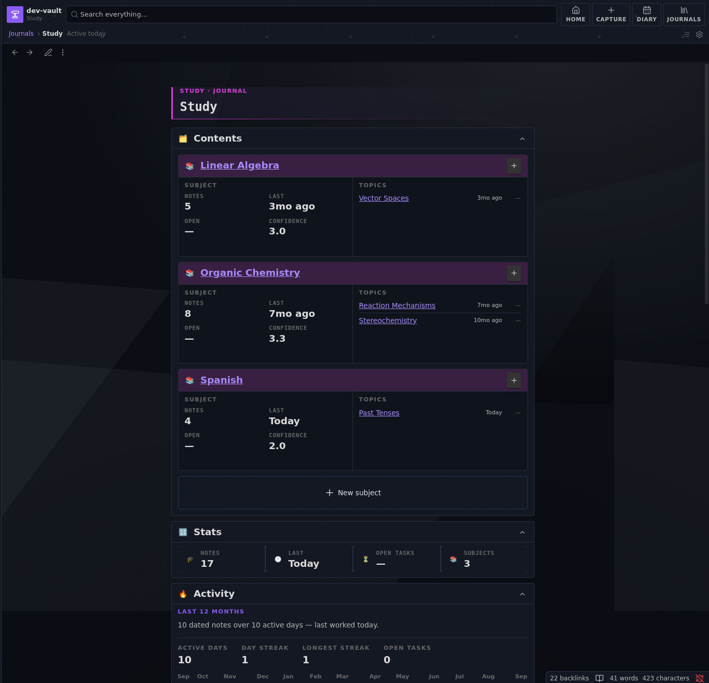 | 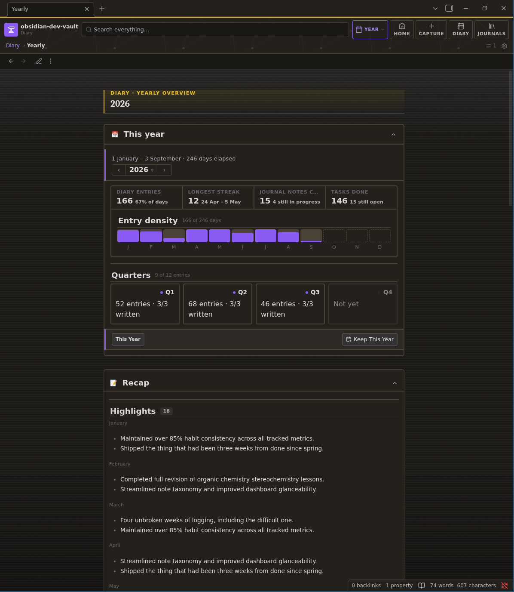 |
| *Subjects, topics, confidence ratings, and activity heatmaps* | *Yearly, quarterly and weekly rollups with recap digests* |

| Journals, defined in settings | Modular section & widget catalogue |
| :---: | :---: |
| 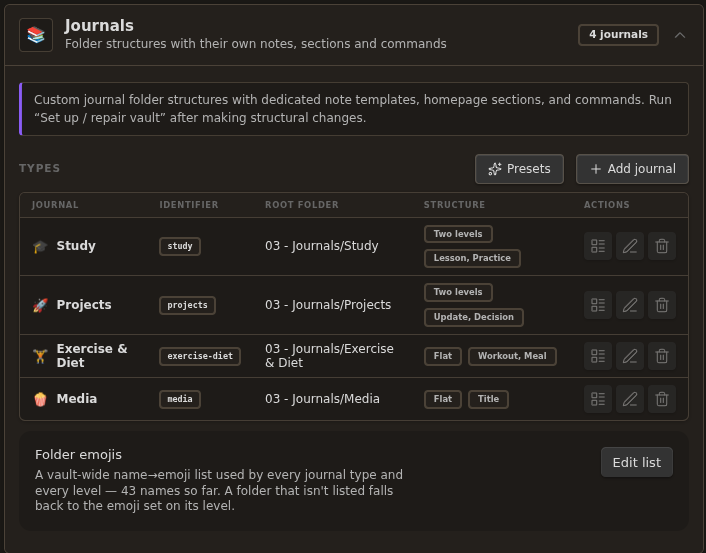 | 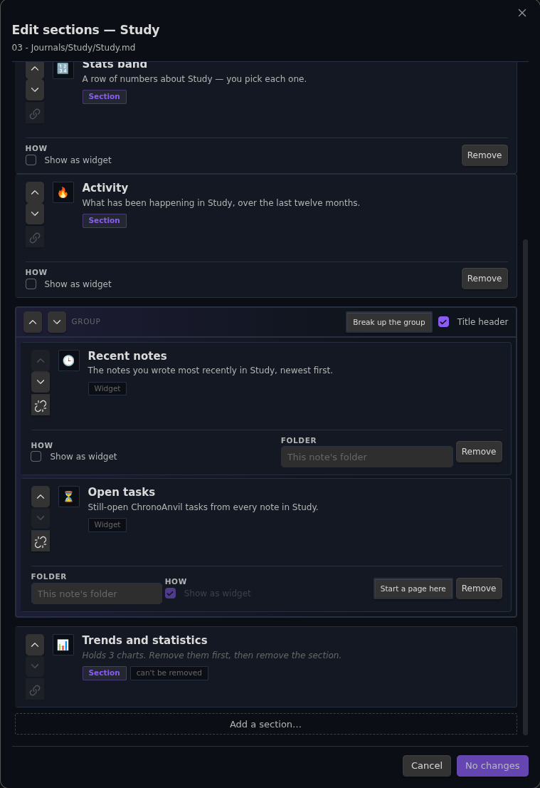 |
| *Identifiers, root folders, levels and note types* | *Modular drag-and-drop section composer* |

| Quick capture | Logbooks |
| :---: | :---: |
| 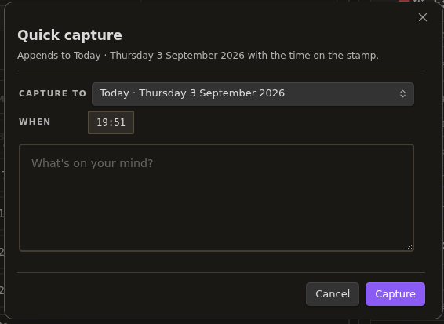 | 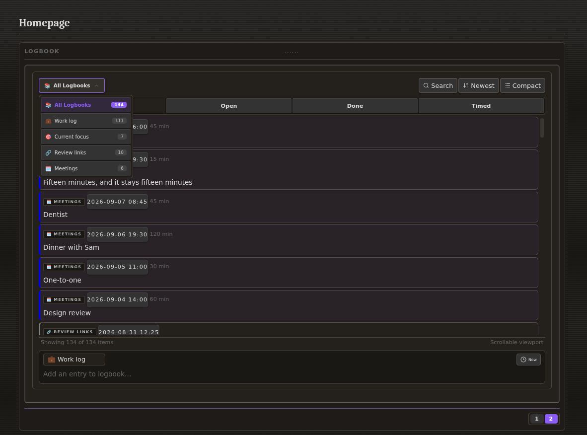 |
| *One box, any note, stamped with the time* | *Named logbooks, open / done / timed, counted* |

| Ground textures & vault banners | Adaptive theme integration |
| :---: | :---: |
| 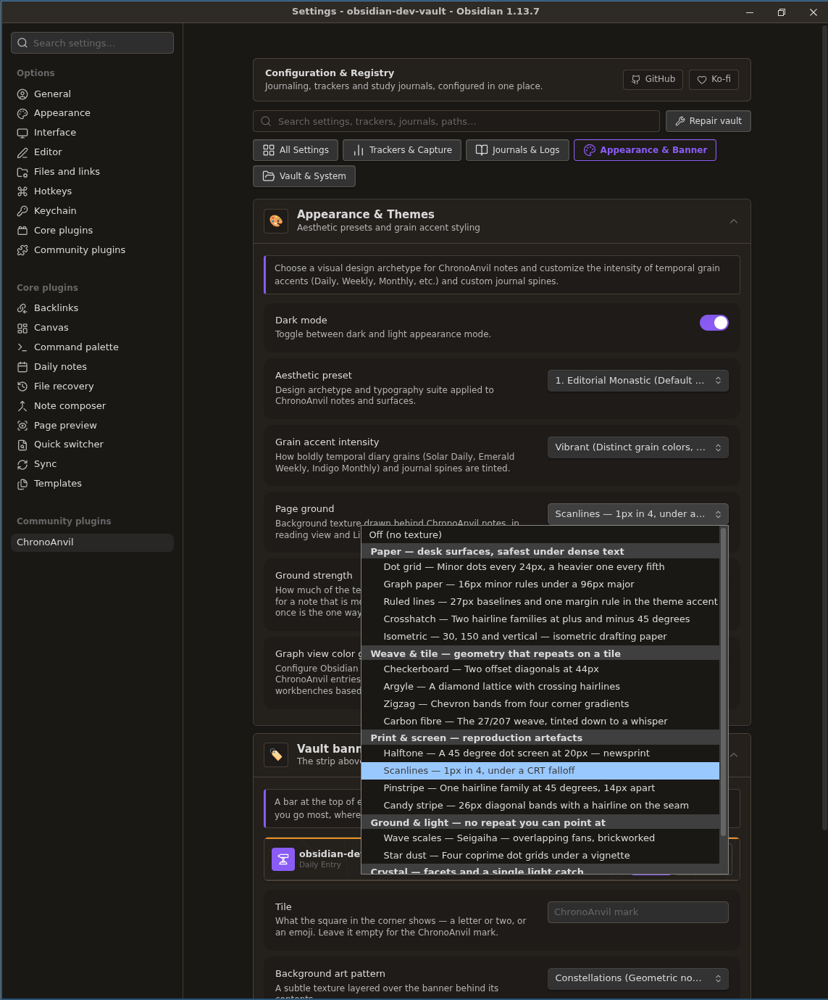 | 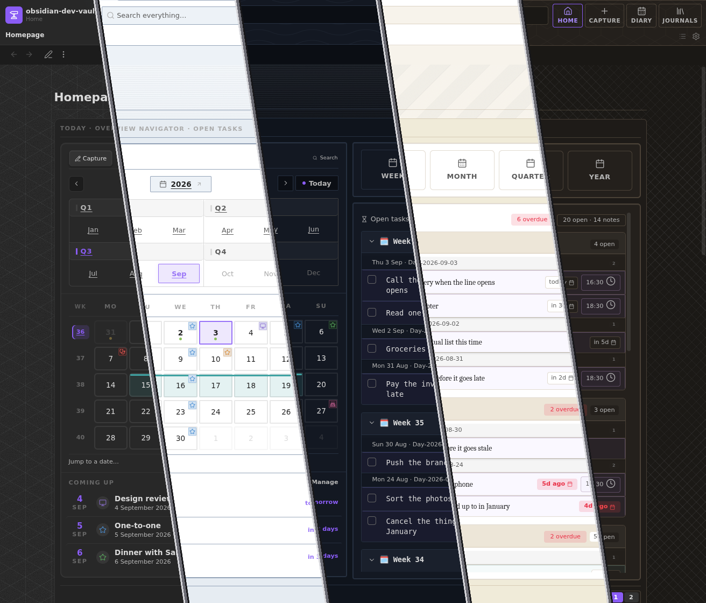 |
| *Dot grid, graph paper, scanlines, weaves & banner customizer* | *One page, five themes — it takes the palette it is given* |

### The week by the hour

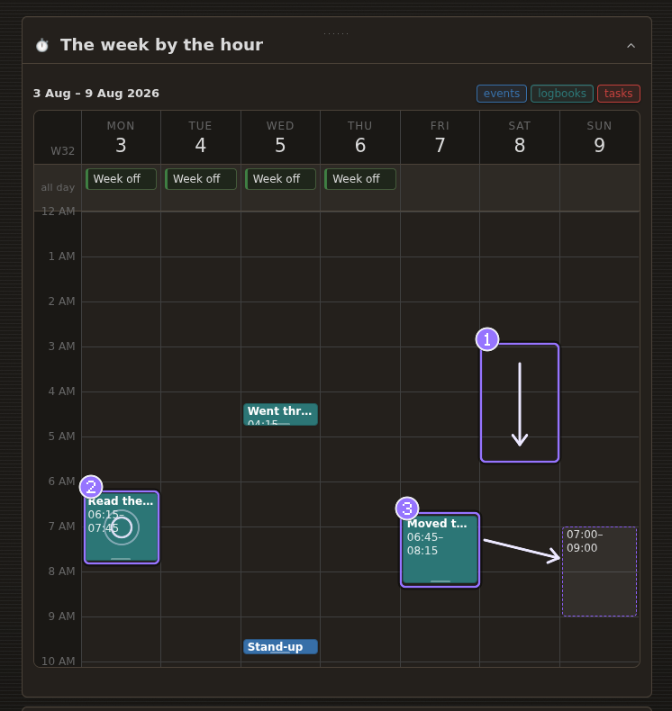

| | Gesture | What it does |
| :---: | --- | --- |
| **1** | Drag down an empty column | Blocks out a new slot at the hours you swept |
| **2** | Click a block | Opens it to edit the title, times and colour *(coming soon)* |
| **3** | Drag a block | Moves it to another day or hour — the dashed outline is where it lands |

## Install

Download `main.js`, `manifest.json` and `styles.css` from a
[release](../../releases) into `<vault>/.obsidian/plugins/chronoanvil/`, enable
it under **Settings → Community plugins**, then run **ChronoAnvil: Maintenance:
set up / repair vault** to scaffold the folders and dashboards.

Those three files are the whole plugin — the notes it scaffolds are compiled
into `main.js`, so there is nothing else to copy.

## Keyboard

No shortcut is claimed by default. Every command lives in the palette under
**ChronoAnvil:**, and any of them can be bound in **Settings → Hotkeys**.

The one worth binding first is **Search everything** — full-text across the
diary and every journal, with date, tag and tracker filters.

## Upgrading from Almanac

ChronoAnvil was called **Almanac** through 4.84. The rename changed the plugin
id, so Obsidian treats it as a different plugin: nothing is lost, but nothing
moves by itself.

```bash
node tools/migrate-vault.mjs <vault>            # dry run — writes nothing
node tools/migrate-vault.mjs <vault> --write    # rewrite it, backup first
```

That rewrites the tokens inside your notes, renames `Almanac.canvas`,
`.almanac-registry.json` and each `.almanac-journal.json`, and moves the plugin
folder so `data.json` comes with it.

**It is not urgent.** The plugin reads both spellings everywhere not finding one
would cost you content, and writes only the new spelling — so an un-migrated
vault opens, works, and migrates itself as you touch it. If your settings look
empty on first launch they are not gone: they are restored from
`.almanac-registry.json` in the vault root.

## Build from source

```bash
npm install
npm test          # 5,300+ tests, ~6s
npm run package   # → dist/chronoanvil/, ready to copy into a vault
```

`npm run dev` watches. `./build.sh` is a thin wrapper that installs dependencies
first if they are missing.

## Documentation

- **[Reference](assets/documentation.md)** — every command, widget, directive
  and setting. The same file the plugin writes into your vault when it
  scaffolds, so it is readable here before you install anything.
- **[Changelog](CHANGELOG.md)** — reader-facing release notes for 5.x.
  Everything before the rename is in
  [CHANGELOG-ARCHIVE.md](./CHANGELOG-ARCHIVE.md).
- **[Contributing](./CONTRIBUTING.md)** — the test contract and the inbound
  licence grant.
- **[Security](./SECURITY.md)** — how to report a vulnerability.

## Contributing

Issues and pull requests are welcome. The test suite is the contract: `npm test`,
`npm run typecheck` and `npx eslint src test` must all be clean. Many tests
assert *why* something is written the way it is — read the comment before
changing one. [CONTRIBUTING.md](./CONTRIBUTING.md) has the rest, including the
licensing terms: you keep your copyright, and your work is published under the
AGPL-3.0 like everything else.

## Support

ChronoAnvil is free software and stays that way. If it has earned a place in
your vault, [Ko-fi](https://ko-fi.com/ahrymx) is where to say so — the same link
Obsidian shows beside the plugin, from `fundingUrl` in the manifest.

## License

Copyright © 2026 AhryMX <contact@ahrymx.dev> — licensed under the
**[GNU Affero General Public License v3.0 or later](./LICENSE)**, with
attribution and naming terms under its section 7.

You are free to use, study, modify, redistribute and sell this software. In
return you must preserve the copyright and licence notices, keep the attribution
*"ChronoAnvil, originally developed by AhryMX"*, mark a modified version as
different from the original, license your version under the AGPL-3.0, and make
the complete corresponding source available to everyone who receives it —
including users who reach it over a network.

Ordinary use is free and needs no permission, companies included: the copyleft
obligations apply when you distribute or offer a network service, not when you
use the plugin in your own vault. Fork freely — but pick your own name and say
where it came from, because section 7 bars using "ChronoAnvil" or "AhryMX" for
publicity or in a way that implies this project endorses your version.

[LICENSING.md](./LICENSING.md) is the plain-English guide with an FAQ.
Third-party components bundled into `main.js` — Chart.js and @kurkle/color, both
MIT — are attributed in [NOTICE](./NOTICE).
