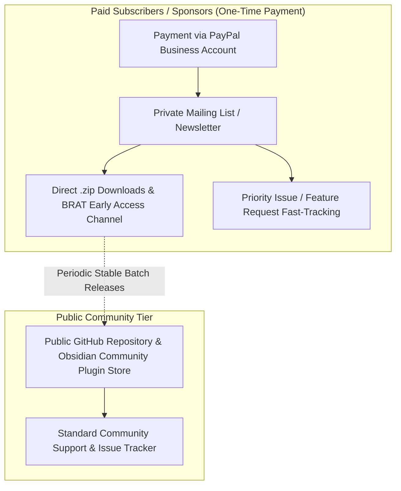

# Almanac Commercialisation & Monetisation Plan

A practical strategy for commercialising Almanac while remaining 100% compliant with the AGPL-3.0 open-source licence, combining **Early Access (Sponsorware)**, **Turnkey Email Delivery**, and **Priority Feature/Bug Fast-Tracking**.

---

## 1. Core Model Overview

---

## 2. Implementation Steps

### Step 1: Payment & Distribution Setup (PayPal Business)
* **Payment Collection Options**:
  * **Direct PayPal Payment Links & Smart Buttons**: Create a fixed one-time payment button/link in PayPal Business dashboard ("Almanac Early Access & Priority Pass"). Configure the post-payment redirect URL to a private subscriber onboarding page / mailing list signup.
  * **PayPal IPN / Webhooks**: Connect PayPal's Instant Payment Notification (IPN) or Webhook via **Zapier** or **Make** to automatically add buyer emails to your mailing list immediately upon payment confirmation.
  * **Ko-fi with Direct PayPal Integration**: Connect your PayPal Business account to Ko-fi for instant 0% platform-fee direct payouts, digital file delivery, and built-in buyer email lists.
* **Email & Delivery Automation**:
  * Use **ConvertKit**, **Buttondown**, or **Mailcoach** to manage the subscriber list.
  * When a new version is built (`npm run package && npm run archive`), email subscribers:
    * Detailed release notes and visual walkthroughs.
    * Direct download links or attached pre-built release `.zip` (`ahrymx.almanac-<version>-plugin.zip`).
    * Clear installation / update instructions.

### Step 2: Early Access via Obsidian BRAT
* Use the community standard [Obsidian BRAT (Beta Reviewers Auto-update Tester)](https://github.com/TfTHacker/obsidian-42-brat) workflow.
* Provide paid subscribers with access to early beta builds or a private release branch directly inside Obsidian, enabling 1-click automatic updates ahead of public directory indexing.

### Step 3: Priority Issue & Feature Fast-Tracking
* **Dedicated Channel**:
  * Provide a dedicated feedback form, private Discord channel, or labeled GitHub Discussions/Issues section for paid subscribers.
* **Guaranteed SLA / Turnaround**:
  * Offer fast-track turnaround (e.g. within 48–72 hours) for subscriber-reported bugs or compatibility fixes.
  * Allow subscribers to vote on or sponsor specific roadmap milestones (e.g. custom tracker visualizations, specialized widgets, or export formats).

### Step 4: Public vs. Paid Release Cadence
* **Paid Channel**: Immediate access to every new minor, patch, and feature build upon completion.
* **Public Community Channel**: Stable batch releases published to GitHub Releases and the Obsidian Community Plugins directory on a delayed cadence (e.g. 2–4 weeks post-release).

---

## 3. AGPL-3.0 Legal & Community Compliance

* **Selling Free Software**: Section 4 of AGPL-3.0 explicitly permits charging any fee for conveying software copies.
* **Source Code Access**: Whenever a paying subscriber receives a compiled build, ensure they have access to the corresponding source code under AGPL-3.0.
* **What Customers Pay For**:
  1. **Convenience**: Ready-to-use bundled zips and automatic updates.
  2. **Speed**: Immediate access to the latest features and fixes weeks before public release.
  3. **Influence & Direct Support**: Direct line of communication and priority roadmap consideration.

---

## 4. Launch Checklist

- [ ] Create PayPal Payment Link / Button in PayPal Business Dashboard.
- [ ] Configure payment redirect page or Zapier/Make automation to add payers to email list.
- [ ] Connect email list provider (Buttondown / ConvertKit) for subscriber updates.
- [ ] Add a "Get Early Access & Priority Support (PayPal)" link/button in `README.md` and settings tab notes.
- [ ] Establish a private subscriber feedback inbox or Discord channel.
- [ ] Document BRAT installation instructions for subscribers.
